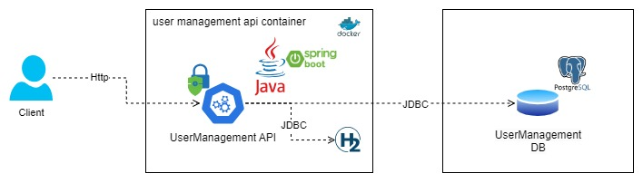
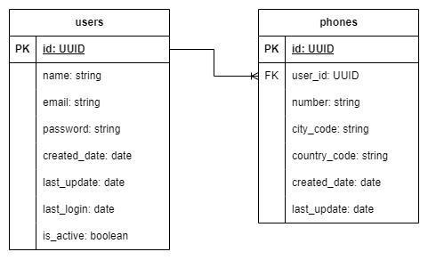

# User Management API

## Description

Proyecto API Rest en Java con Spring boot que permite el registro y autenticación de usuarios. El API está documentada
con Swagger.

La base de datos usada es PostgreSQL. Para la seguridad se implementa Spring Security con JWT que garantiza el acceso al
API con autenticación.

## Previous requirements

- Java 11

## Technologies

- Java 11
- Spring boot
- Spring Security
- PostgreSQL
- JWT
- Open API

## Database configuration

Actualiza las configuraciones de la base de datos en el archivo `src/main/resources/application-${perfil}.yml` con las
credenciales de la base de datos.

```yaml
spring:
  datasource:
    type:com.zaxxer.hikari.HikariDataSource
    url:jdbc:postgresql://${HOST}:${PORT}/${DBNAME}
    driver-class-name:org.postgresql.Driver
    username:${USER}
    password:${PASS}
```

## Swagger API documentation

La documentación de la API se genera automáticamente con Swagger. Puedes acceder a ella
en [swagger-ui](http://localhost:8080/user-management-api/swagger-ui/index.html) después de iniciar la aplicación.

# Solution diagram



# Entity relationship diagram



## Installation

```bash
$ gradle build
```

## Run test

```bash
$  .\gradlew.bat test
```

## Execution with Docker

1. Asegúrate de tener Docker instalado en tu máquina.
2. Desde la raíz del proyecto, construye la imagen de Docker ejecutando el siguiente comando:

```bash
docker build --tag user-management-api-i -f Dockerfile.mem .
```

En el caso de usar PostgreSQL, usa el siguiente

```bash
docker build --tag user-management-api-i --build-arg PASS=<password> --build-arg USER=<user> --build-arg HOST=<host> --build-arg PORT=<port> --build-arg DBNAME=<name> .
```

3. Después de que se haya construido la imagen, ejecuta el contenedor con el siguiente comando:

```bash
docker run --name user-management-api-i-con -d -p 8080:8080 user-management-api-i:latest
```

La API ahora estará en funcionamiento y será accesible en http://localhost:8080 desde tu máquina local.
