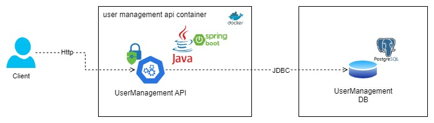

# User Management API

## Description

Proyecto API Rest en Java con Spring boot que permite el registro y autenticación de usuarios. El API está documentada
con Swagger.

La base de datos usada es PostgreSQL. Para la seguridad se implementa Spring Security con JWT que garantiza el acceso al
API con autenticación.

## Previous requirements

- Java 11

## Technologies

- Java 11
- Spring boot
- Spring Security
- PostgreSQL
- JWT
- Open API

## Database configuration

Actualiza las configuraciones de la base de datos en el archivo `src/main/resources/application-${perfil}.yml` con las
credenciales de la base de datos.

```properties
spring:
datasource:
type:com.zaxxer.hikari.HikariDataSource
url:jdbc:postgresql://${HOST}:${PORT}/${DBNAME}
driver-class-name:org.postgresql.Driver
username:${USER}
password:${PASS}
```

## Swagger API documentation

La documentación de la API se genera automáticamente con Swagger. Puedes acceder a ella
en [swagger-ui](http://localhost:8080/user-management-api/swagger-ui/index.html) después de iniciar la aplicación.

# Solution diagram



# Entity relationship diagram


## Installation

```bash
$ gradle build
```

## Run test

```bash
$ gradle test
```